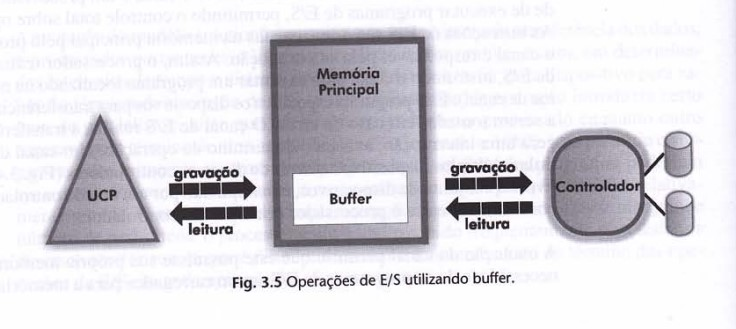

<h1 align="center">🔸Buffering🔸</h1>

## Conceito

Enquanto a memória cache é parte da estrutura do processador, o <i>buffer</i> ou <i>buffering</i> é uma técnica de processamento de dados. Quando se fala em <i>buffer</i>, deve-se ter em mente a ideia de uma memória temporária reservada para guardar uma quantidade de dados enquanto eles estão sendo processados ou transferidos. 
   
Em outras palavras, <i>Buffering</i> é uma técnica que consiste na utilização de uma área na memória principal, denominada buffer, para a transferência de dados entre os dispositivos de entrada e de saída e a memória. De acordo com Francis Berenger Machado e Luiz Paulo Maia, "esta técnica permite que em uma operação de leitura o dado seja transferido primeiramente para o buffer, liberando imediatamente o dispositivo de entrada para realizar uma nova leitura." 
 
Assim sendo, enquanto o processador manipula o dado armazenado no buffer, o dispositivo de entrada/saída realiza outra operação de leitura. A mesma dinâmica também ocorre nas operações de gravação. 

 

O <i>buffering</i> permite, então, que o problema da disparidade da velocidade de processamento entre o processador e os dispositivos de entrada/saída seja minimizado.

## Funcionamento

A unidade de transferência usada no mecanismo de <i>buffering</i> é o registro. Seu tamanho pode ser especificado em função da natureza do dispositivo, como uma linha gerada por uma impressora ou um caractere do teclado, ou da aplicação, como um registro lógico definido em um arquivo. 
 
"O buffer deve permitir armazenar diversos registros, de forma que existam dados lidos, mas ainda não processados (operação de leitura), ou processados, mas ainda não gravados (operação de gravação). Desta forma, o dispositivo de entrada poderá ler diversos registros antes de o dispositivo de saída realizar a gravação. Isso é extremamente eficiente, pois, dessa maneira, é possível compatibilizar a diferença existente entre o tempo em que o processados executa as instruções e o tempo em que o dispositivo de E/S realiza as operações de leitura e gravação."
 

## Referências

https://www.youtube.com/watch?v=cHb3IkCGUBo  
https://www.youtube.com/watch?v=HpSi_W3x07I  
MACHADO, Francis B; MAIA, Luiz P. Arquitetura de Sistemas Operacionais. 4. ed. Rio de Janeiro: LTC, 2007. 305 p. ISBN 978-85-216-1548-4.
