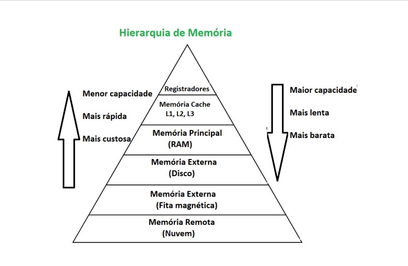
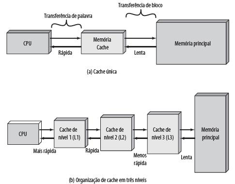
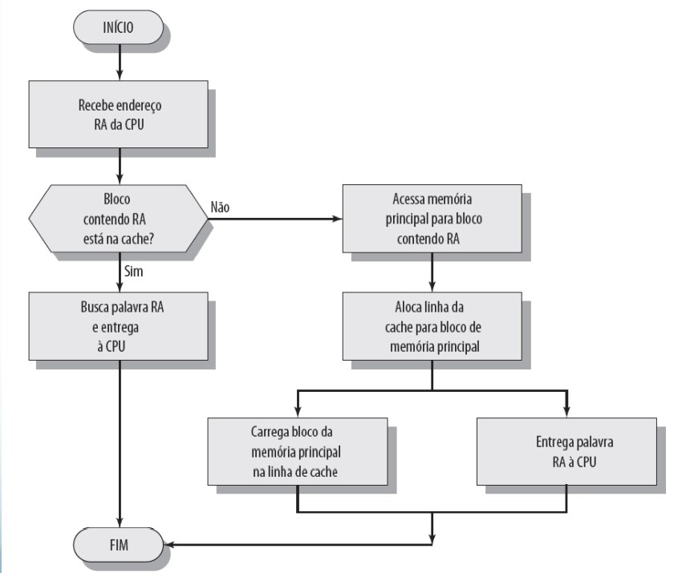

<h1 align="center">🔸Memória Cache🔸</h1>

## Conceito

<p align="justify">A memória cache fica localizada no processador que, por sua vez, está instalado em soquetes, de modo que as informações são levadas de um componente a outro por meio do barramento. A cache é conhecida como a memória da CPU e, por estar próxima do chipset, é mais acessível e consegue transferir dados de forma ágil e eficiente. Como a memória cache faz parte do processador, seu tamanho é reduzido e, consequentemente, sua capacidade de armazenamento também é menor quando comparada à memória principal.<br>
<br>
Quando o assunto é capacidade de armazenamento, custo e velocidade dos diferentes tipos de memória, é necessário esclarecer que há uma relação inversamente proporcional que rege essas grandezas. Isto porque as memórias mais rápidas são mais caras e têm menor capacidade de armazenamento, ao passo que as memórias de acesso mais lento são mais baratas e podem armazenar mais dados. Essas características precisam ser sopesadas de acordo com a necessidade do usuário e são ilustradas na figura abaixo:<br>
<br>
</p>

<div align="center">
  
</div>
  
<p align="center">Fonte: IME - USP.</p>
<br>
 
  ## Função
  
<p align="justify">O computador funciona seguindo um ciclo de Busca > Decodificação > Execução. No entanto, o maior problema desse ciclo é que a velocidade do processador é muito maior que a da memória RAM. Para evitar que o processador fique muito tempo ocioso aguardando resposta da memória RAM, foi desenvolvida a memória cache, que é mais rápida que a RAM. Assim é mais vantajoso que o processador busque os dados na cache do que na RAM. Porém, devido à limitação de capacidade, a memória cache só vai armazenar os dados mais importantes (usados com mais frequência) para o processador.<br>
<br>
Em resumo, a função da memória cache é melhorar o desempenho do computador.</p>

## Princípios da memória cache

<p align="justify">A memória cache funciona de acordo com os seguintes princípios:<br>
<br>
a) <b>Localidade espacial</b>: segundo este princípio, se eu busquei uma determinada instrução, as chances de eu querer buscar a instrução seguinte são altas. Por esse motivo, a memória cache sempre buscará um bloco da memória principal.<br>
<br>
Isto é assim porque, espacialmente, na memória, as instruções provavelmente estarão em posições contíguas. Ou seja, os dados são organizados sequencialmente (vetores, listas, tabelas, matrizes) e, consequentemente, os programas são escritos de forma sequencial, de maneira que as próximas instruções estão geralmente próximas da instrução atual. Além disso, os programas apresentam variáveis de controle em pequeno número que são acessadas frequentemente, como ocorre por exemplo no índice de um laço (trecho de código curto que é executado várias vezes):<br></p>

```
for (i=0; i<100; i++)
```

<p align="justify">b) <b>Localidade temporal</b>: a partir deste princípio, se eu busquei uma palavra agora, as chances de eu querer buscá-la novamente em um curto período de tempo são altas. Daí a necessidade de armazenar o dado em uma memória mais rápida (cache).<br>
<br>
Na prática, o princípio da localidade temporal é materializado toda vez que uma mesma posição de memória é acessada diversas vezes em um curto período de tempo, como acontece por exemplo toda vez que um programa aciona uma variável dentro de um loop ou quando um programa se utiliza de ponteiros para acessar uma informação em determinado lugar da memória.<br>
<br>
Os computadores mais modernos têm organização de cache em três níveis, conforme ilustrado a seguir:<br></p>

<div align="center">
  
</div>
  
<p align="center">Fonte: UFSM.</p>
<br>

## Processo de leitura

<p align="justify">Toda vez que o processador busca uma informação na memória cache e a encontra, ocorre o chamado <b>cache hit</b>, ao passo que, se ele buscar uma informação na memória cache e não a encontrar, ocorrerá o chamado <b>cache miss</b>.<br>
<br>
Os computadores mais modernos têm organização de cache em três níveis, conforme ilustrado a seguir:<br></p>

<div align="center">
  
</div>
  
<p align="center">Fonte: UFSM.</p>
<br>

## Referências

<p>
https://www.youtube.com/watch?v=1WGq74ptXGw<br>
https://www.youtube.com/watch?v=ZpGqJ-YsXf4<br>
http://coral.ufsm.br/tiago/introcomp/Aula%203%20-%20Memoria.pdf<br>
Tanenbaum, Andrew S. Sistemas Operacionais Modernos. Tradução de Ronaldo A. L. Gonçalves, Luís A. Consularo, Luciana do Amaral Teixeira. 3. ed. São Paulo: Pearson Prentice Hall, 2009. 653 p. ISBN 978-85-7605-237-1.
</p>
