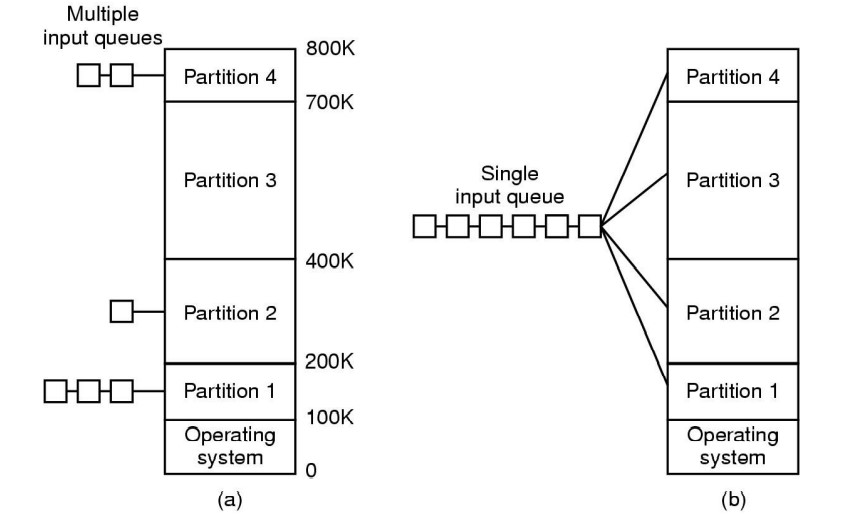
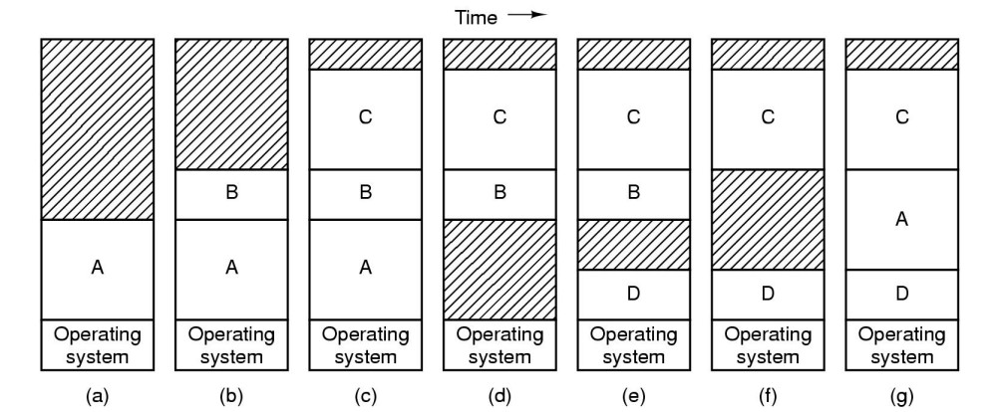
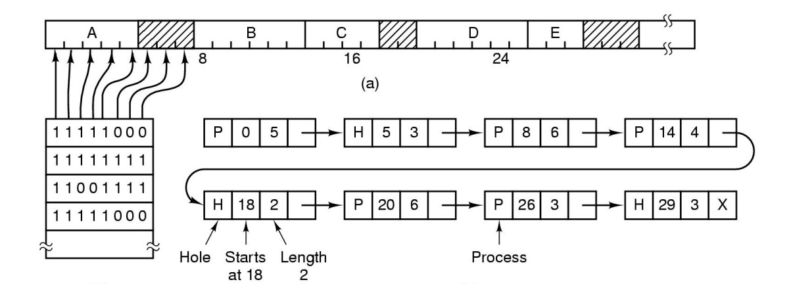
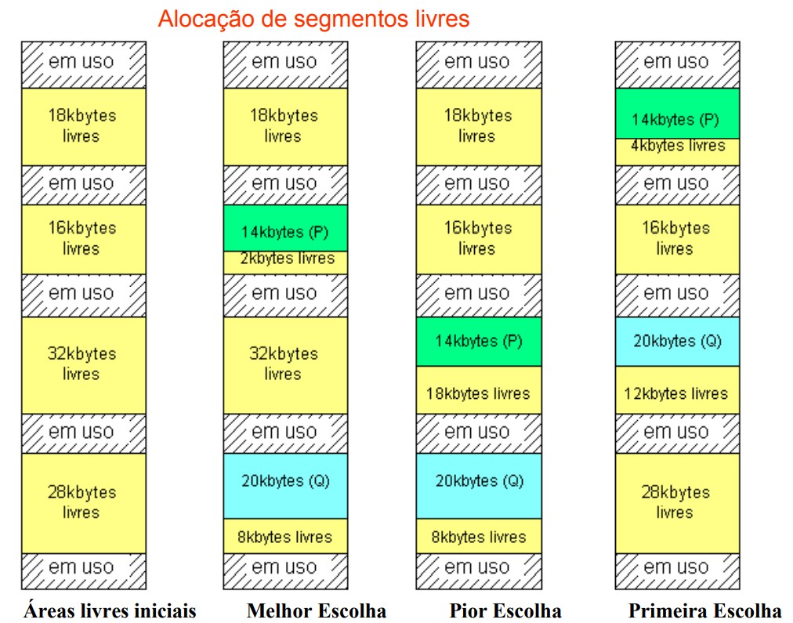

<h1 align="center">🔸Gerenciamento de Memória🔸</h1>

## Noções preliminares

O sistema operacional tem duas funções principais:

- Ser a interface que facilita a comunicação do usuário com o computador;
- Ser um administrador de recursos (saber quando deve alocar um determinado recurso para um programa e quando deve retirar um recurso de outro programa).

Um processo é um programa em execução que possui um processador. Esse processador é compartilhado de maneira que esse processo possa usar de forma otimizada o processador entre os vários processos (programas em execução). 
 
Se a RAM for pequena, o gerenciamento de memória será muito mais demandado para evitar que haja gargalos nos processos. 
 
Existem dois tipos de memória principal: 
   
a) Memória Lógica: manipulada pelos programas, ou seja, sempre que um programa necessitar alocar um espaço de memória, esse espaço será alocado na memória lógica (software); 
   
b) Memória Física: memória implementada pelos circuitos integrados (hardware), seu tamanho normalmente é menor do que o da memória lógica. 

## Conceito

Em se tratando de sistemas multiprogramáveis, caracterizados pelo compartilhamento de recursos entre usuários, surge a necessidade de um método de gerenciamento de recursos, mais especificamente, de gerenciamento de memória. Sendo assim, o gerenciamento de memória cuida do controle de quais partes da memória estarão em uso e quais não estarão. 
 
Os programas atuais podem ser muito grandes, sendo incapazes de ser completamente armazenados na memória cache. Então, com o gerenciamento de memória, passou a ser possível realocar espaços de memória entre memória principal (RAM) e memória secundária (HD), de acordo com as necessidades dos processos. 
 
Em um ambiente de multiprogramação, o SO deve proteger as áreas de memória ocupadas por cada processo, além da área onde reside o próprio sistema. Caso um programa tente realizar algum acesso indevido à memória, o sistema de alguma forma deve impedi-lo. Apesar de a gerência de memória garantir a proteção de áreas da memória, mecanismos de compartilhamento devem ser oferecidos para que diferentes processos possam trocar dados de forma protegida. 

## Etapas 

Atualmente existem vários layouts/estruturas de memórias, dos quais podemos citar: 
 
a) Monoprogramação: existe um único processo sendo executado no sistema. Ex.: MS-DOS (MicroSoft Disk Operating System = sistema operacional por linha de comando) e Palm OS. 
 
b) Multiprogramação: vários computadores que compartilham a mesma CPU e a mesma memória. Ex.: sistemas de veículos autônomos, Linux e Windows. 
 
O gerenciamento de memória é dividido nas seguintes etapas: 
 
- Partição da memória: divide a memória principal em várias partições diferentes, de maneira que cada uma delas fique alocada para determinada partição. Em cada partição poderá haver mais de um job/tarefa na fila. 
 
- Proteção dos processos: é feita por 2 registradores, um que armazena a base e outro que armazena o limite, para que um processo não invada o limite de outro processo. A CPU adiciona o valor base ao endereço e verifica se o endereço é maior ou igual ao limite. P. ex.: se o usuário tem um programa de 40KB e esse programa foi armazenado no endereço 20 da memória principal, seria necessário somar esses válores, chegando ao resultado 60. Ou seja, 60 seria o endereço que efetivamente o processo utilizará. Os processos só utilizam endereços lógicos (que vão de 0 ao número máximo correspondente ao tamanho do processo). Nesse exemplo, o 20 seria a base e o 60 seria o limite. 

## MMU (_Memory Management Unit_)

Considerando que o ambiente de multiprogramação utiliza endereços lógicos, é necessário fazer a conversão desses endereços em endereços físicos (ou endereços físicos reais). E o circuito responsável por essa conversão é o MMU. 

## Tipos de partições

Francis B. Machado divide as alocações em 2 tipos: 
 
1) Alocação Contígua Simples: 
 
Muito comum nos sistemas monoprogramáveis, a alocação contígua simples é definida como um modelo subdividido em duas áreas: uma para o sistema operacional e uma para o programa do usuário. Dessa forma, o programador deve desenvolver suas aplicações preocupado apenas em não ultrapassar o espaço de memória disponível, respeitando a diferença entre o tamanho total da memória principal e a área ocupada pelo sistema operacional. 

  

  

  

Fonte: ICMC - USP

 

Nesse modelo, o usuário tem controle sobre toda a memória principal, podendo ter acesso a qualquer posição de memória, inclusive a área do sistema operacional.Para proteger o sistema desse tipo de acesso, alguns sistemas implementam proteção através de um registrador que limita as áreas do sistema operacional e do usuário, de forma que sempre que um programa fizer referência a um endereço na memória, o sistema precise verificar se o endereço está dentro dos limites permitidos. Caso não esteja, o programa é cancelado e uma mensagem de erro é gerada, indicando que houve uma violação no acesso à memória principal. 
 
Embora seja de fácil implementação e tenha código reduzido, este tipo de alocação não permite a utilização eficiente dos recursos computacionais, pois apenas um usuário pode dispor desses recursos. Em relação à memória principal, caso o programa do usuário não a preencha totalmente, existirá um espaço de memória livre sem utilização. 
 
Obs.: Na alocação contígua simples, todos os programas são limitados ao tamanho da área de memória principal disponível para o usuário. Uma solução encontrada para o problema é dividir o programa em módulos, de forma que seja possível a execução independente de cada módulo, utilizando uma mesma área de memória. Essa técnica é chamada de Overlay. 
   
A definição das áreas de overlay é função do programador, através de comandos específicos da linguagem de programação utilizada. O tamanho de uma área de overlay é estabelecido a partir do tamanho do maior módulo. A vantagem dessa técnica é permitir ao programador expandir os limites da memória principal. Importante destacar que a utilização desta técnica exige muito cuidado, pois pode trazer implicações tanto na sua manutenção quanto no desempenho das aplicações, devido à possibilidade de transferência excessiva dos módulos entre a memória principal e a secundária. 
 

2) Alocação Particionada: 
   
Este tipo de alocação permite que diversos programas estejam na memória principal ao mesmo tempo e que novas formas de gerência da memória sejam implementadas. Esse tipo de alocação pode ser separado em: 
 
a) Alocação particionada estática (Partições fixas): são determinadas no momento do boot do sistema. 
- Tamanho e número de partições são fixos; 
- Tendem a desperdiçar memória; 
- As partições podem ser iguais ou não (em relação ao tamanho) e são chamadas de páginas, blocos ou frames;
- Mais simples. 
 

  

  

Fonte: ICMC - USP

 

b) Alocação particionada dinâmica (Partições variáveis): ocorrem durante o tempo de execução dos programas. 
- Tamanho e número de partições variam; 
- Otimiza a utilização da memória, mas complica a alocação e a liberação; 
- As partições são alocadas dinamicamente; 
- Fragmentação interna: é um porção de memória de uma determinada partição que não é utilizada devido aos requisitos reduzidos dos processos, ou seja, ocorre quando <b>o tamanho do processo é menor que a área alocada</b>, p. ex., uma partição com 6Kb aloca um processo de 5Kb, causando desperdicio de 1Kb de memória. Em outras palavras, pode-se dizer que esse tipo de fragmentação ocorre quando um arquivo ou fragmento de arquivo não ocupa completamente o espaço da unidade de alocação destinado a ele, causando desperdício de espaço na memória principal; 
- Fragmentação externa: ocorre quando existe espaço suficiente de memória livre para satisfazer uma requisição, porém, não é continuo e não pode ser utilizado. Isto é, ocorre quando um processo precisa de um espaço, por exemplo 5Kb, porém, esse espaço só existe em duas lacunas, uma de 3kb e outra de 2kb, em lugares separados. Este tipo de fragmentação começa a acontecer quando os programas forem terminando e deixando espaços cada vez menores na memória, não permitindo o ingresso de novos programas. 
 

  

  

Fonte: PUC-Rio

## Swapping

Nesse momento é necessário mencionar a questão do swapping, ou seja, a transferência de dados e partições entre a memória principal e a memória secundária. Como nem tudo cabe na memória principal, reservam-se partes que não estão sendo manuseadas em uma área de swapping, utilizada para fazer essa permuta. 
 
Swap-in = transferência do disco para a memória principal 
 
Swap-out = transferência da memória principal para o disco 
 
No swapping o sistema basicamente tira o conteúdo da memória principal e coloca no disco, e vice-versa. Em outras palavras, o swapping é uma técnica que permite que novos processos sejam executados, ainda que não haja espaço livre na memória principal, através da transferência temporária de processos residentes na memória principal para a memória secundária, liberando espaço para novos processos. 
 
Obs: Overlay e memória virtual = são técnicas que permitem a execução de programas maiores do que o espaço disponível na memória física. 

## Estruturas de gerenciamento de memória

a) Bitmap (mapa de bit):
- A memória é dividida em unidades de alocação;
- Cada unidade pode conter vários KB;
- Cada unidade corresponde a um bit no bitmap: 0 -> livre / 1 -> ocupado

b) Lista encadeada:
- Mantém uma lista ligada de segmentos de memória livres e alocados
- A lista contém o processo (P), o endereço de início e o endereço final
- O H denota Hole, a área de memória que não está ocupada. P. ex.: H 5 3 -> existe uma área vaga a partir do endereço 5 por 3 posições.

 

  

  

Fonte: PUC-Rio

## Algoritmos de alocação

Há três formas de alocar uma área livre para um processo:

a) Melhor escolha: escolher a área que mais se encaixa para o processo. Busca a lista inteira e toma a menor partição;

b) Pior escolha: inversamente à melhor escolha, busca a lista inteira e toma a maior partição;

c) Primeira escolha: o processo é alocado no primeiro espaço que couber.

  

Fonte: ICMC - USP

## Referências

http://www-di.inf.puc-rio.br/~endler/courses/inf1019/transp/aulas-teoricas/cap-4.pdf 
http://wiki.icmc.usp.br/images/c/c7/Aula10.pdf 
https://www.youtube.com/watch?v=TwlIiA1HhT4 
https://www.youtube.com/watch?v=Q8ZqjEafmNc 
https://www.youtube.com/watch?v=9AK_1gqEfkQ 
MACHADO, Francis B; MAIA, Luiz P. Arquitetura de Sistemas Operacionais. 4. ed. Rio de Janeiro: LTC, 2007. 305 p. ISBN 978-85-216-1548-4.
