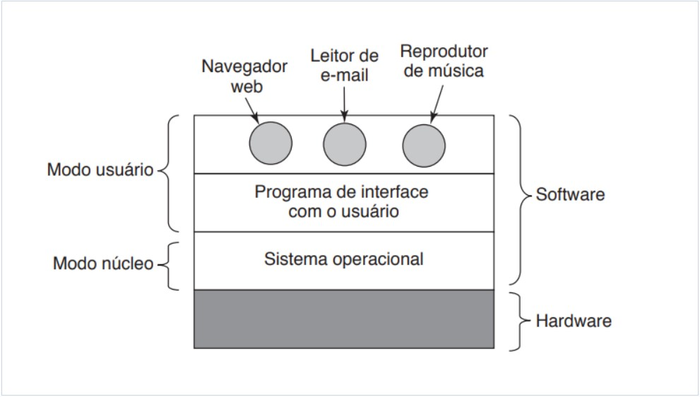

<h1 align="center">🔸Kernel🔸</h1>

## Conceito

O sistema operacional é formado por um conjunto de rotinas que oferece serviços aos usuários e às suas aplicações. Esse conjunto de rotinas é denominado <i>núcleo do sistema</i> ou <i>Kernel</i>. 
 
Obs.: Embora a maioria dos sistemas operacionais seja fornecida junto com utilitários e linguagem de comandos (ferramentas de apoio ao usuário), essas ferramentas não são parte do núcleo do sistema. 
 
Os usuários podem se comunicar com o Kernel de três formas distintas: 
 
a) Por meio de rotinas do sistema realizadas por aplicações; 
 
b) A partir de utilitários (cada sistema operacional oferece seus próprios utilitários, como compiladores e editores de texto); 
 
c) A partir de linguagem de comandos (particular de casa sistema, com estruturas e sintaxes próprias). 
 

  
 

 
Fonte: Alura, 2022.

 

As rotinas do sistema são executadas concorrentemente sem uma ordem predefinida, com base em eventos dissociados do tempo (eventos assíncronos), sem que haja um sequenciamento de início, meio e fim. Além disso, muitos desses eventos são relacionados ao hardware e a tarefas internas do próprio sistema operacional. 
 
Rotinas do sistema = compõem o núcleo do sistema e oferecem serviços aos usuários e suas aplicações 
 
System calls = faz o controle de execução de rotinas do SO. Toda vez que uma aplicação desejar chamar uma rotina do SO, o system call é ativado. 

- Vê se a aplicação tem privilégios necessários para executar a rotina desejada;
- Se tiver, o SO salva o conteúdo corrente nos registradores, troca o modo de acesso e realiza o desvio para a rotina desejada. Ao término da rotina, o modo é alterado para usuário novamente; e 
- Se não tiver, o SO impede o desvio para a rotina, sinalizando a programa chamador que a operação não é possível.

Rotinas de sistema + System calls = porta de entrada para o núcleo

## Funções do núcleo

O primeiro ponto importante a ser destacado quando se fala em funções do núcleo é que as rotinas do sistema são executadas concorrentemente sem uma ordem predefinida, com base em eventos dissociados do tempo (eventos assíncronos), sem que haja um sequenciamento de início, meio e fim. Além disso, muitos desses eventos são relacionados ao hardware e a tarefas internas do próprio sistema operacional. 
 
Como exemplo das principais funções do núcleo encontradas nos sistemas operacionais é possível citar: 

* Tratamento de interrupções e exceções;
* Criação e eliminação de processos e threads;
* Sincronização e comunicação entre processos;
* Escalonamento e controle dos processos e threads;
* Gerência de memória;
* Gerência do sistema de arquivos;
* Gerência de dispositivos de E/S;
* Suporte a redes locais e distribuídas;
* Contabilização do uso do sistema;
* Auditoria e segurança do sistema.

Resumo:

* Aplicação convencional -> sequenciamento de início, meio e fim 

* Rotinas de sistema -> executadas concorrentemente sem uma ordem predefinida, com base em eventos dissociados do tempo (eventos assíncronos). Muitos desses eventos estão relacionados ao hardware e a tarefas internas do próprio sistema operacional.

* Os usuários se comunicam com o hardware por meio de aplicações, utilitários ou linguagem de comandos.

* As rotinas do SO compõem o núcleo do sistema ou Kernel.

## Execução concorrente 

Como garantir a confiabilidade na execução concorrente de todos os programas e nos dados dos usuários e a integridade do próprio SO numa situação em que diversos usuários compartilham os mesmos recursos (p. ex., memória, processador, dispositivos de E/S)? 
 
Uma das principais características da multiprogramação é permitir que vários programas compartilhem o processador. O SO deve ser responsável pelo controle da utilização da CPU, de forma a impedir que algum programa monopolize o seu uso inadequadamente. 
 
Como vários programas ocupam a memória simultaneamente, cada usuário deve possuir uma área reservada onde seus dados e código são armazenados. O SO implementa mecanismos de proteção, preservando estas informações. Caso o programa tente acessar uma posição de momória fora de sua área, ocorrerá um erro indicando a violação de acesso. Para que diferentes programas tenham o direito de compartilhar uma mesma área de memória, o SO deve oferecer mecanismos para que a comunicação seja feita de forma sincronizada e controlada, evitando, desta forma, problema de inconsistência. 
 
De modo semelhante ao compartilhamento de memória, um disco pode armazenar arquivos de diferentes usuários. Mais uma vez o SO deve garantir a integridade e confidencialidade dos dados, permitindo ainda que dois ou mais usuários possam ter acesso simultâneo ao mesmo arquivo. 
 
Para solucionar esses diversos problemas originados pelo ambiente multiprogramável, o SO deve implementar mecanismos de proteção que controlem o acesso concorrente aos diversos recursos do sistema. 

## Modos de acesso

Uma preocupação que surge nos projetos de SO é a implementação de mecanismos de proteção ao núcleo do sistema e de acesso aos seus serviços. Caso uma aplicação, que tenha acesso ao núcleo, realize uma operação que altere sua integridade, todo o sistema poderá ficar comprometido e inoperante. Muitas das principais implementações de segurança de um SO utilizam um mecanismo presente no hardware dos processadores, conhecido omo modo de acesso. 
 
Os processadores normalmente têm dois modos de acesso: 
 
a) Modo usuário (espaço de aplicação = modo no qual as aplicações normalmente são executadas -> não é possível executar instruções privilegiadas): quando um processador trabalha no modo usuário, uma aplicação só pode executar instruções conhecidas como não-privilegiadas, tendo acesso a um número reduzido de instruções; 
 

- não tem acesso direto ao hardware
- executa instruções não-privilegiadas
- o software/aplicativo é executado, como navegador, editor de texto, reprodutor de áudio e vídeo utilizam esse espaço

b) Modo kernel (tem controle total sobre a CPU, pode executar todas as instruções do conjunto de instruções do processador em questão -> o SO é executado neste modo. Antes de o SO passar o controle da CPU para uma aplicação do usuário, o bit de controle de modo é configurado para o modo de usuário): em contrapartida, quando um processador trabalha no modo kernel, a aplicação pode ter acesso ao conjunto total de instruções do processador. 
 
O modo de acesso é determinado por um conjunto de bits, localizado no registrador de status do processador, que indica o modo de acesso corrente. Por intermédio desse registrador, o hardware verifica se a instrução pode ou não ser executada. 
 

- tem acesso direto ao hardware
- a principal funcionalidade é de executar instruções privilegiadas
- está protegido de ser acessado por programas de aplicativos ou partes menos importantes do SO
- é um espaço para o gerenciamento de um computador, como alocação de memória e gerenciamento de processos
- pode ler e escrever para mídia de armazenamento, por exemplo

As instruções privilegiadas não devem ser utilizadas de maneira indiscriminada pelas aplicações, pois isso poderia ocasionar sérios problemas à integridade do sistema. 
 
IMPORTANTE: 
 
Instruções privilegiadas -> são instruções que só devem ser executadas pelo SO ou sob sua supervisão, impedindo, assim, a ocorrência de problemas de segurança e integridade no sistema. Caso contrário, o hardware irá impedir a execução da instrução. 
 
Instruções não-privilegiadas -> não oferecem risco a sistema e podem ser executadas em modo usuário porque não modificam a alocação ou o estado dos recursos compartilhados por vários processos simultâneos, tais como processadores, memória principal e registradores especiais. Ao contrário das instruções privilegiadas que podem alterar o estado e a alocação desses recursos. 
 
Caso uma aplicação tenha acesso a áreas de memória onde está carregado o SO, um programador mal-intencionado ou um erro de programação poderia gravar nesta área, violando o sistema. Com o mecanismo de modo de acesso, para uma aplicação escrever numa área onde resida o SO, o programa deve estar sendo executado no modo kernel. 
 
RESUMO: 
 
Os modos de acesso foram criados para limitar a forma como cada usuário acessa as funções do sistema e para proteger o núcleo do sistema operacional, impedindo que um programador mal-intencionado ou erro de programação corrompa o sistema. 
 
O manual do SO precisa especificar como executar as instruções. Além disso, na prática, apenas visualizando as aplicações em funcionamento, não é possível diferenciais quais instruções são privilegiadas ou não, mas é possível identificar esses tipos de instruções analisando o quanto essas instruções vão afetar a integridade e a segurança do sistema. 
 
Cada sistema operacional tem uma lista pré-definida de system calls. Com base na documentação do Linux, por exemplo, é possível identificar que o comando "sys_read" executa instruções não privilegiadas, pelo fato de ser utilizado apenas para leitura de determinado arquivo. Por outro lado, é possível identificar que o comando "sys_write" executa instruções privilegiadas, uma vez que é utilizado escrever/gravar algum dado em determinado arquivo, e a depender do tipo de escrita a integridade do sistema pode ser comprometida. 

## Rotinas do SO e Systems Calls

- Compõem o núcleo do SO, oferecendo serviços aos usuários e suas aplicações.
- Todas as funções do núcleo são implementadas por rotinas do sistema que necessariamente possuem em seu código instruções privilegiadas.
- Para que essas rotinas possam ser executadas, o processador deve estar obrigatoriamente em modo kernel, o que exige a implementação de mecanismos de proteção para garantir a confiabilidade do sistema.
- System call = mecanismo que controla a execução de rotinas do SO. Toda vez que uma aplicação deseja chamar uma rotina do SO, o system call é ativado.

Primeiro Passo: o SO verifica se a aplicação possui privilégios necessários para executar a rotina desejada. 
 
Se não, o SO impede o desvio para a rotina do sistema, sinalizando ao programa chamador que a operação não é possível -> mecanismo de proteção por software no qual o SO garante que as aplicações só poderão executar rotinas do sistemaque estão previamente autorizadas. Essa autorização prévia é realizada peo administrador do sistema (Processo). 
 
Se sim, o SO primeiramente salva o conteúdo corrente dos registradores, troca o modo de acesso do processador de usuário para kernel e realiza o desvio para a rotina alterando o registrador PC com o endereço da rotina chamada. Ao término da execução da rotina do sistema, o modo de acesso é alterado de kernel para usuário e o contexto dos registradores restaurados para que a aplicação continue a execução a partir da instrução que chamou a rotina do sistema. 
 
Uma aplicação sempre deve executar com o processador em modo usuário. Caso uma aplicação tente executar diretamente uma instrução privilegiada sem ser por intermédio de uma chamada à rotina do sistema, um mecanismo de proteção por hardware garantirá a segurança do sistema, impedindo a operação. Neste situação, em que a aplicação tenta executar uma isntrução privilegiada em modo usuário e sem a supervisão do SO, o próprio hardware do processador sinalizará um erro. Uma exceção é gerada e a execução do programa é interrompida, protegendo desta forma o núcleo do sistema. 
 

  
 

 
Fonte: MACHADO, MAIA, 2007.

 

Acesso ao disco: 
 

- Para o programa atualizar um arquivo, a aplicação deve solicitar a operação de E/S ao SO por meio de uma chamada a uma rotina do sistema;

- O mecanismo de system call verifica se a aplicação possui privilégio para a operação e, em caso positivo, altera o modo de acesso do processador (usuário -> kernel);

- Após executar a rotina de leitura, o modo de acesso volta ao estado usuário para continuar a execução do programa.

Os mecanismos de System Call e de proteção por hardware garantem a segurança e a integridade do sistema, impedindo que as aplicações executem instruções privilegiadas sem a autorização e a supervisão do SO.

## Arquiteturas do núcleo

Forma como o código do sistema é organizado e o inter-relacionamento entre os seus componentes pode variar conforme a concepção do projeto. Deve ser levada em consideração ao projetar um SO para o atendimento de diversos requisitos como portabilidade, confiabilidade, manutenção etc. 
 
a) Monolítica → pode ser comparada a uma aplicação formada por vários módulos que são compilados separadamente e depois linkados, formando um grande e único programa executável, onde os módulos podem interagir livremente. 
 
Nesse modelo, os serviços de usuário e kernel são implementados no mesmo espaço de memória (não há memória diferente usada para serviços de usuários e serviços de kernel). A execução do processo é mais rápida, pois não usa espaço separado do usuário e do kernel. Exemplo de sistema operacional que usa núcleos monolíticos é o Linux; 
 
b) Camadas: sistema composto por níveis sobrepostos. Cada camada oferece um conjunto de funções que podem ser utilizadas apenas pelas camadas superiores. P. ex.: usuário -> supervisor -> executivo -> Kernel 
 
Vantagem: isolar as funções do SO, facilitando a manutenção e a depuração + criar hierarquia de níveis de modo de acesso, protegendo camadas mais internas. 
 
Desvantagem: Desempenho, já que cada nova camada implica uma mudança no modo de acesso. 
 
Atualmente a maioria dos sistemas comerciais utiliza o modelo de duas camadas: modo usuário (não-privilegiado) e modo kernel (privilegiado). Ex.: maioria das versões Unix e Windows. 
 
c) Máquina virtual: sistema formado por níveis, sendo o hardware o nível mais baixo. Acima dele temos o SO (suporte para aplicações) e, em nível intermediário, há a gerência de máquinas virtuais, um nível que cria diversas MV independentes, e cada uma delas oferece uma cópia virtual do hardware (incluindo modo de acesso, interrupções, dispositivos de E/S etc.) 
 
Vantagem: permite a convivência de vários SOs diferentes no mesmo computador e cria o isolamento total entre cada MV, oferecendo segurança pra cada uma delas. 
 
Desvantagem: essa arquitetura é muito complexa porque precisa compartilhar e gerenciar recursos do hardware entre as diversas MVs. 
 
d) Microkernel → Os serviços de usuário e kernel são implementados em dois espaços diferentes. Inclui apenas os serviços e dispositivos essenciais para que o sistema funcione. O tamanho do kernel é menor, o que reduz o tamanho do sistema operacional. 
 
Vantagem: permite isolar as funções do SO por diversos processos servidores pequenos e dedicados a serviços específicos, tornando o núcleo menor e mais fácil de depurar, aumentando a confiabilidade. Mais fácil manutenção, flexível e maior portabilidade. 
 
e) Kernel híbrido → É a combinação de monolítico e microkernel. Permite executar alguns serviços para reduzir o desempenho em comparação com um microkernel tradicional e com a velocidade um kernel monolítico. Exemplo: Windows NT. 
 
f) Nanokernel → Menor tipo de kernel. São usados principalmente em sistemas ou dispositivos com recursos limitados; 
 
g) Exokernel → Possui proteção e gerenciamento de recursos separados. São variações do microkernel que incluem recursos adicionais para dispositivos móveis, como gerenciamento de energia e suporte para vários processadores. 

## Referências

https://www.alura.com.br/artigos/sistemas-operacionais-conceito-estrutura 
https://www.youtube.com/watch?v=ds1pNi-N8pQ 
MACHADO, Francis B; MAIA, Luiz P. Arquitetura de Sistemas Operacionais. 4. ed. Rio de Janeiro: LTC, 2007. 305 p. ISBN 978-85-216-1548-4. 

