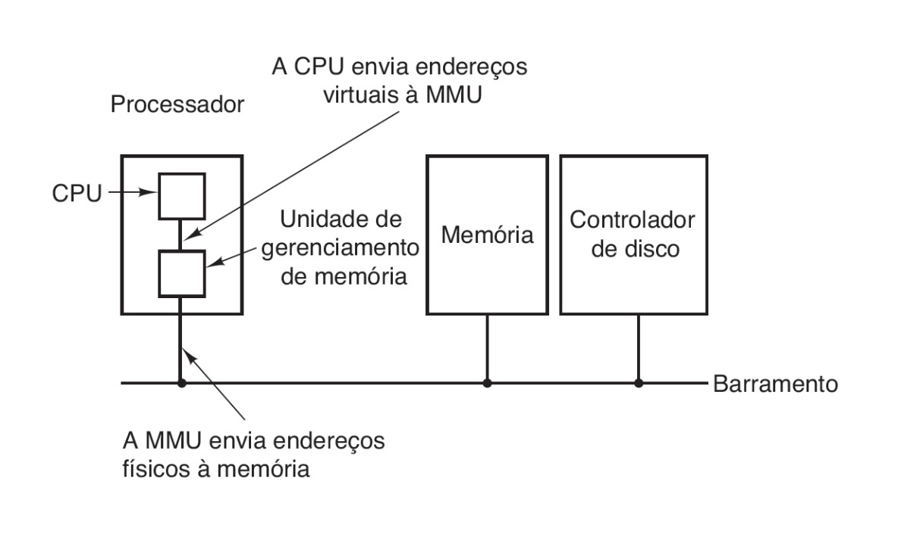
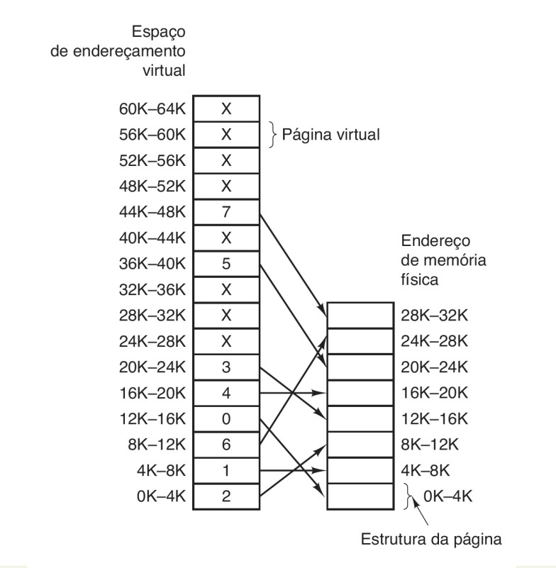
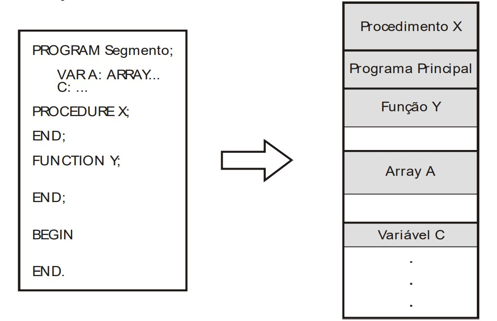

<h1 align="center">🔸Memória Virtual🔸</h1>
 

## Conceito

Dentro do ambiente de multiprogramação existe uma enorme quantidade de processos e quando todos esses processos não cabem na memória principal, esta precisa se valer de técnicas de processamento. Ou seja, para que a memória principal consiga dar conta de todos esses processos, existe a técnica da memória virtual, que garante maior eficiência a esses processos e ao funcionamento do computador como um todo. 
 
Essa técnica usa a memória secundária como uma “cache” para partes dos processos que não cabem na memória principal, permitindo que todos os processos possam utilizar a memória principal. Quem cria e gerencia essa memória virtual é o SO. 
 
Só são transportadas para a memória virtual as partes da memória principal que estão de fato sendo usadas pelos processos. Ou seja, temos duas vantagens principais: 

- Um processo pode executar sem ter todas as instruções e dados dentro da memória principal;
- O espaço de memória disponível ao programa pode exceder o tamanho da memória principal.

Também utiliza o MMU (circuito dentro do processador) para conversão dos endereços lógicos em endereços físicos, considerando que um processo usa endereços virtuais e não físicos. 
 

  

 
 Funcionamento do MMU (IFRN).

   
  
→ [Voltar ao topo](#topo)

## Técnicas

<b>PAGINAÇÃO:</b> 
 
Consiste em quebrar os processos em páginas de tamanho fixo (p. ex. 4KB). Cada página contém partes do processo (do espaço de endereçamento do processo). Com isso, o espaço de endereçamento virtual é dividido em páginas virtuais. 
 
Obs.: Na paginação é possível misturar os tipos de informações, p. ex., códigos com textos, ou dados com pilhas etc. 
 
Dentro da paginação, existem as páginas (do lado do disco) e os frames (do lado da RAM). As páginas são as unidades de tamanho fixo no dispositivo secundário, ao passo que os frames consistem nas unidades correspondentes na memória física (RAM). 
 
Paginação sob demanda: as páginas serão criadas quando o sistema solicitar. 
 
Obs.: Page Fault => falta de página. Quando uma página não está na RAM é referenciada. Usa uma trap para carregar ou substituir uma página. (TRAP é o nome dado ao sinal de interrupção de software dado a CPU para que ela interrompa a execução de um processo para executar outro. O processo interrompido tem seus dados armazenados na memória para que seja executado posteriormente.) 
 
Obs. 2: Tabela de páginas => estrutura para mapear uma página ao frame correspondente. Cada processo tem uma. É uma espécie de índice de processos e também ocupa um espaço na memória. 
 
A busca do endereço pode ser sequencial ou binária, mas qualquer uma delas ainda é lenta, uma vez que ocorre um overhead (sobrecarga) do gerenciador de memória. O SO fica sobrecarregado em virtude das rotinas de gerenciamento dele próprio. 
 
Para encontrar o endereço físico, será essencial encontrar as seguintes informações: 
 
P = número da página 
 
D = deslocamento da página 
 Com esses dois valores teremos o chamado offset e conseguiremos definir o endereço de memória físico. 
 

<b>EXEMPLO DE PAGINAÇÃO:</b> 
 
Quando um programa executa a instrução mov REG, 20500, por exemplo, significa que ele deseja copiar o conteúdo do endereço de memória 20500 para o registrador REG. 
 
Partindo do esquema a seguir, cálculo do deslocamento será feito da seguinte forma: 
 

  

 
 Referenciamento de páginas e frames (IFRN).

   

Deslocamento = Endereço virtual - Endereço virtual do 1º byte da página  
Deslocamento = 20500 - 20480 = 20 
 
Obs.: No esquema, o endereço virtual está contido no espaço 20K-24K, logo, o primeiro byte dessa página será 20480 (convertendo 20Kb em bytes). 
 
Endereço físico = Endereço do 1º byte do frame + deslocamento 
Endereço físico = 12288 + 20 = 12308 
 
Obs.: A página em questão está sendo referenciada no frame 3 (12K-16K), então, convertendo 12Kb em bytes teremos 12288 bytes. 

As tabelas podem ser armazenadas: 

- Em um array de registradores, se a memória for pequena (são mantidas no hardware);
- Na própria RAM, gerenciada pelo MMU, que utiliza 1 ou 2 registradores;
- Em uma memória cache no MMU (memória associativa), usada para melhorar o desempenho da tabela na RAM.

Se um processo que não está na memória física (mas na MV) precisa ser utilizado e a memória física não tem mais espaço, o SO precisa usar algum algoritmo de substituição, p. ex.: 

a)	FIFO = o primeiro a entrar é o primeiro a sair (fila); 
 
b)	LRU = exclui a página que não é referenciada há mais tempo (pilha); 
 
c)	Optimal = exclui a página que levará mais tempo para ser novamente necessária (pilha); 
 
d)	Clock-FINUFO = tem como base valores aproximados dos reais quanto ao último acesso à página (implementação simplificada da LRU); 
 
e)	Segunda chance = a página escolhida para sair é a que tem os bits de acesso e de modificação zerados. 

→ [Voltar ao topo](#topo)

<b>SEGMENTAÇÃO:</b> 
 
Consiste em blocos de tamanho arbitrário chamados de segmentos que contêm informações do mesmo tipo. Aqui, o espaço de endereçamento é quebrado em vários espaços (textos, códigos, dados etc.). 
 
Um programa é dividido logicamente em sub-rotinas e estruturas de dados, que são alocados em segmentos na memória principal.  
 

  

 
 Segmentação da memória (IFRN).

   

A segmentação permite uma relação entre a lógica do programa e a sua divisão na memória. Além disso, é importante destacar que a definição dos segmentos é realizada pelo compilador e que o tamanho do segmento pode ser alterado durante a execução do programa. 
 
Obs.: O mecanismo de mapeamento é semelhante ao da paginação, neste caso, os segmentos são mapeados através de tabelas de segmentos. Cada processo possui sua própria tabela de segmentos. 
 
Vantagem: se a informação consistir em texto por exemplo, consigo dar um comando apenas de leitura, que afetará somente aquele segmento, sem influenciar nos demais.
Muitos SOs misturam essas duas técnicas para ter as vantagens de todas elas. 
 
<b>IMPORTANTE:</b> 
 
Paginação: invisível ao programador, serve para prover um espaço maior de endereçamento. Memória dividida em páginas de igual tamanho, com qualquer conteúdo. 
 
Segmentação: em geral visível ao programador, serve para organizar programas e dados, associando atributos de privilégio e proteção a instruções e dados. Os segmentos de um programa residem no disco. Apenas segmentos em uso são carregados na memória. O tamanho de um segmento não é fixo. 

→ [Voltar ao topo](#topo)

## Referências

https://www.ime.usp.br/~song/mac344/slides07-virtual-memory.pdf  
http://www.ic.uff.br/~boeres/slidesSOI/SOSI-aula5-memoriavirtual-completo.pdf  
https://docente.ifrn.edu.br/tadeuferreira/disciplinas/2015.2/sistemas-operacionais/Aula16.pdf  
https://www.to-convert.com/pt/informatica/converter-kilobyte-para-byte.php  
MACHADO, Francis B; MAIA, Luiz P. Arquitetura de Sistemas Operacionais. 4. ed. Rio de Janeiro: LTC, 2007. 305 p. ISBN 978-85-216-1548-4.
