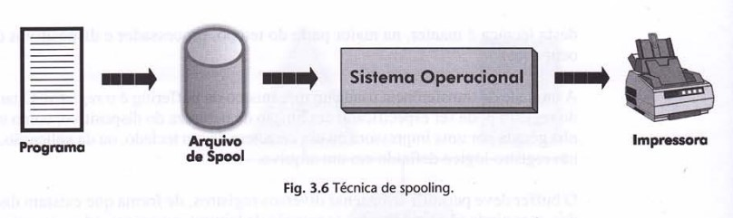

<h1 align="center">🔸Spooling🔸</h1>

## Conceito

<i>Spooling</i> (Simultaneous Peripheral Operation On-line) é uma técnica que surgiu no final dos anos 1950 para aumentar o grau de concorrência e a eficiência dos sistemas operacionais. 
 
Obs.: a ideia de concorrência está diretamente ligada à possibilidade de o processador executar várias tarefas ao mesmo tempo, permitindo que vários programas sejam executados concorrentemente pelo sistema operacional. 
 
Antes os programas eram submetidos um a um ao processamento pelo operador, isto porque, como a velocidade de operação dos dispositivos de E/S é muito menor que a do processador, era comum que a CPU permanecesse ociosa enquanto esperava os programas e dados de entrada ou o término de uma impressão. 

## Funcionamento

A solução encontrada então foi armazenar os vários programas e seus dados (jobs) em uma fita magnética e, em seguida, submetê-los a processamento. Com isso, o processador foi capaz de executar sequencialmente cada job, diminuindo o tempo de processamento e transição entre eles. Assim, ao invés de um job gravar suas saídas diretamente na impressora, por exemplo, poderia direcioná-las para uma outra fita, que mais tarde seria impressa integralmente. 
 
Como as fitas magnéticas obrigavam o processamento sequencial, se um job que levasse mais horas antecedesse pequenos jobs, o tempo de resposta ficava seriamente comprometido. Dessa maneira, com o surgimento de dispositivos de acesso direto/dispositivos de armazenamento secundário (que armazenam dados em locais discretos com um endereço exclusivo, como HDs, disquetes, CDs e DVDs, por exemplo), o spooling se tornou mais eficiente, possibilitando o processamento não sequencial dos jobs. 
 
O <i>spooling</i> é executado de modo parecido com o <i>buffering</i>, a diferença é que o primeiro utiliza uma área do disco enquanto processos são executados concorrentemente, ao passo que o segundo utiliza uma área da memória principal. Essa área em disco é utilizada como se fosse um grande buffer, o que permite que os dados sejam lidos ou gravados em disco enquanto programas são executados concorrentemente. 
 
O exemplo clássico da aplicação da técnica de spooling consiste no procedimento de impressão de um arquivo. Ou seja, para que um comando de impressão seja executado, primeiramente as informações que serão impressas são gravadas em um arquivo em disco (arquivo de spool), liberando o programa para outras atividades. Só então é que o sistema operacional encarrega-se de direcionar o conteúdo do arquivo de spool para a impressora, conforme ilustrado a seguir: 

 

O uso do spooling permite, portanto, desvincular o programa do dispositivo de impressão, impedindo que um programa reserve a impressora para uso exclusivo. O sistema operacional fica responsável por gerenciar a sequência de impressões solicitadas pelos programas, a partir de critérios que garantam a segurança e o uso eficiente das impressoras. 
 
O spooling, neste caso, utilizará a memória secundária porque a impressora tem uma velocidade de processamento inferior à do processador, então a memória principal (mais veloz) fica disponível para executar tarefas que exijam maior velocidade. 

## Referências

https://www.youtube.com/watch?v=HpSi_W3x07I  
MACHADO, Francis B; MAIA, Luiz P. Arquitetura de Sistemas Operacionais. 4. ed. Rio de Janeiro: LTC, 2007. 305 p. ISBN 978-85-216-1548-4.
